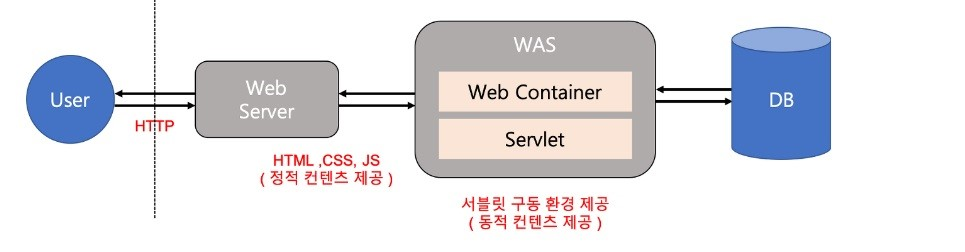

### Tomcat이 정확히 어떤 역할을 하는 도구인가요?

* Apache  
  * Web Server 
  클라이언트에서 요청하는 HTTP 요청을 처리하는 웹 서버를 의미  
  이는 정적타입(HTML, CSS, 이미지 등)의 데이터만을 처리한다.  
  그런데 동적인 기능인 php가 Apache에서 잘 돌아가긴 하는데, 이는 Apache에서 php 스크립트를 읽는 기능도  
  지원을 하기 때문이다.

* nginx  
  * Web Server로 주로 사용 되지만, Web Application의 기능도 일부 수행함!  
  Apache처럼 동적인 파일을 읽는 기능을 지원하지 않아서, 정석대로는 웹 서버 애플리케이션을 설치해야 한다.  
  그런데, 안정성이 부족할 뿐 사실 돌아가긴 한다. 안정성을 위해서는 uswgi를 설치하면 된다.  
  주로 nginx<->uwsgi<->dajngo의 구조로 돌아간다

* Tomcat  
  * Web application server : WAS  
  Java EE 기반으로 만들어졌으며, JSP와 Servlet을 구동하기 위한 서블릿 컨테이너 역할을 수행한다  
  아파치 서버와는 다르게 DB연결, 다른 응용프로그램과 상호 작용 등 동적인 기능들을 사용할 수 있다

[참고블로그](https://bombo96.tistory.com/65)
[참고블로그2](https://yon11b.tistory.com/63)
