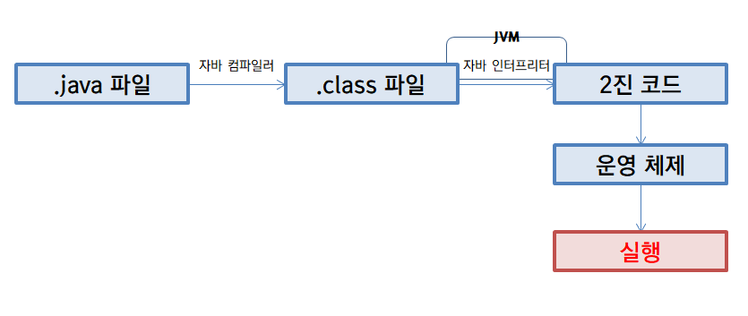

### 컴파일 언어와 인터프리터 언어

자바는 컴파일 언어와 인터프리터 언어의 중간이다  
이른바 '하이브리드 언어'라고도 불린다

처음에는 인터프리터 언어로써 사용되다가, 성능 향상을 위하여 컴파일 언어의 장점을 가져왔다

[참고사이트](https://jooona.tistory.com/157)

### 컴파일 언어란?

컴파일이란 : 인간들이 알아보는 소스코드와 반면으로, 프로그램 제작자가 코볼, 포트란 따위의 고급 언어로 쓰인 프로그램을 번역하고, 컴퓨터에서 실행할 수 있는 기계어 프로그램으로 고치는 과정

컴파일 언어 : 기계가 이해할 수 있는 언어로 변환하는 컴파일 과정을 통해 한꺼번에 번역해서 수행하는 언어  
컴파일 과정 : 전처리 후 소스코드의 주석을 제거하고 헤더를 병합, 전처리된 파일을 사람이 읽고 이해할 수 있는 어셈블리어로 바꾸어줌  

컴파일러를 통해서 어셈블리어로 병합, 기계어로 병합

링커를 통해서 컴파일 된 기계어를 실행가능 한 컴파일 파일로 생성시켜준다  
로더를 통해서 생성된 컴파일 된 파일을 실행시키기 위해 메모리에 탑재시켜 준다  

컴파일 된 이후로는 속도가 빠르나, 컴파일 타임이 있다  

### 인터프리터 언어란?
 전체 소스코드를 한 번에 보단 한 줄 한 줄 실행시키는 것으로,  
 실행속도가 컴파일 언어보다 현저히 느리다  
 *인터프리터*가 소스 코드를 한 줄씩 읽고 실행한다
